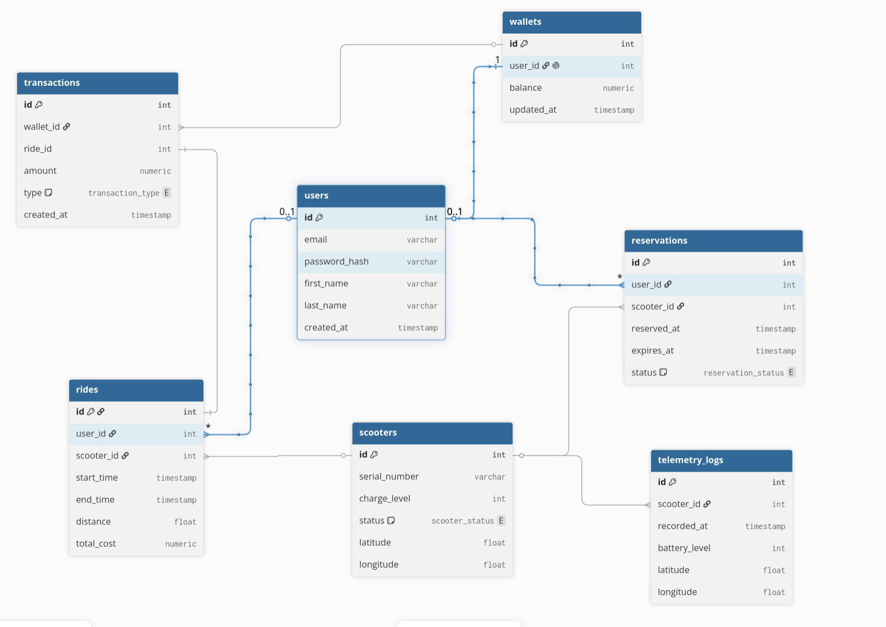

# ScootShare: E-Scooter Sharing Web Platform

## Project Overview
ScootShare is a full-stack web application for e-scooter rentals. The main goal of the project is to demonstrate the design of a robust relational database capable of handling concurrent access (Race Conditions) and ensuring strict consistency of financial and transport transactions (ACID). 

The project focuses on complex database logic and transaction management on the backend, supported by an interactive user interface on the frontend.

## Key Features

### Backend (Java Spring Boot)
* Transaction Management: Implementation of atomic operations during the rental process (deducting funds, locking the scooter, creating a ride record).
* Concurrency Control: Utilizing pessimistic locking (`SELECT FOR UPDATE`) to prevent the booking of the same scooter by two different users simultaneously.
* Complex Analytics: SQL queries using aggregations (`GROUP BY`, `SUM`, `AVG`), multi-table `JOIN` operations, and window functions to generate business reports.
* REST API: Providing endpoints for frontend integration.

### Frontend (React)
* Single Page Application (SPA) for seamless user interaction.
* Map or list display of available e-scooters.
* Interface for booking, wallet management, and viewing ride history.
* Analytical dashboard for the Admin role.

## Technology Stack
* Backend: Java, Spring Boot, Spring Data JPA (Hibernate), Spring Web.
* Frontend: React, JavaScript/TypeScript, Axios.
* Database: PostgreSQL (with potential PostGIS extension for spatial data processing).

## Database Specification (Data Model)

The database architecture consists of 12 related tables, divided into 3 logical blocks:

### Block 1: Users and Finances

1. `users` — System users.
    * `id` (PK), `email`, `password_hash`, `first_name`, `last_name`, `created_at`.
2. `wallets` — Users' virtual wallets (1:1 relationship with `users`).
    * `id` (PK), `user_id` (FK), `balance` (Numeric), `updated_at`.
3. `transactions` — History of deposits and charges (N:1 relationship to `wallets`).
    * `id` (PK), `wallet_id` (FK), `ride_id` (FK), `amount`, `type` (transaction_type), `created_at`.

### Block 2: Transport and Infrastructure

4. `scooters` — Specific physical units.
    * `id` (PK), `serial_number`, `charge_level` (int), `status` (scooter_status), `latitude`, `longitude`.

### Block 3: Rentals and Logging

5. `reservations` — Temporary holds when a user is walking to the scooter. **Key table for testing concurrency.**
    * `id` (PK), `user_id` (FK), `scooter_id` (FK), `reserved_at`, `expires_at`, `status` (reservation_status).
6. `rides` — Ride history and billing.
    * `id` (PK), `user_id` (FK), `scooter_id` (FK), `start_time`, `end_time`, `distance`, `total_cost`.
7. `telemetry_logs` — History of coordinate and battery changes for all scooters.
    * `id` (PK), `scooter_id` (FK), `recorded_at`, `battery_level`, `latitude`, `longitude`.
## Key Database Scenarios

### 1. Rental Transaction with Race Condition Prevention
The process of starting a ride (or reservation) is atomic and protected from parallel modifications.
* Scenario: Two users attempt to book the last available scooter in a parking zone at the exact same millisecond.
* Implementation:
  1. A database transaction begins.
  2. A `SELECT * FROM scooters WHERE id = X FOR UPDATE` query is executed (Pessimistic Row-level Lock).
  3. The system checks the scooter's status (proceeds only if `AVAILABLE`).
  4. The system checks the user's `wallets` balance.
  5. A record is inserted into the `reservations` table.
  6. The scooter's status is updated to `RESERVED`.
  7. The transaction is committed. (The second user's transaction will either wait for the lock release and fail the status check, or immediately throw a locking exception, depending on the timeout configuration).

### 2. Complex Analytical Report (Data Aggregation)
* Business Case: Display the top 3 parking zones in a specific city that generated the highest revenue over the last month, including the average ride duration and the count of unique users per zone.
* SQL Implementation: This will require executing a `JOIN` across the `rides`, `zones`, and `cities` tables, applying aggregation functions (`SUM(total_cost)`, `AVG(end_time - start_time)`, `COUNT(DISTINCT user_id)`), filtering data by date (`WHERE start_time >= ...`), grouping the results (`GROUP BY zone_id`), and sorting them (`ORDER BY revenue DESC LIMIT 3`).
